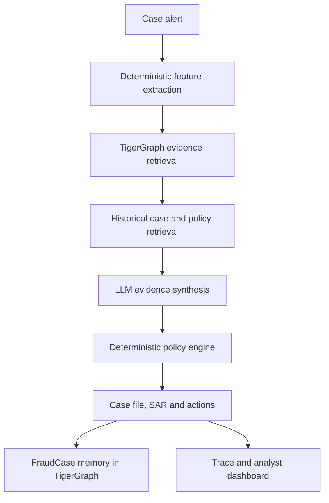

# From Alert to Case File: Building an Agentic Fraud Investigator on TigerGraph

*A risk score says "look here." Our system does the looking: it gathers connected evidence from a graph, weighs it, applies the bank's policy and writes a case an analyst can check line by line.*

---

## 1. The investigation gap

Late on a Tuesday night, a card is used for a $292 online purchase. The bank's real-time model scores it 0.79. Is it fraud?

Nobody knows yet. In the dataset we worked with, most transactions scored above 0.7 turn out to be legitimate, and some real fraud scores close to zero. A score is a reason to open a file, not a conclusion.

A human investigator would start asking questions. Is $292 unusual for this cardholder? Is the device new? Are nearby transactions part of the same episode? Does the billing region fit their history? Have other cards used the same device? What happened in similar past investigations? And given all that, what is the bank allowed to do?

Our project automates that line of questioning. We did not train a new fraud model. We built an **investigation agent**: a system that takes an alert, collects evidence, reasons over it and produces a policy-compliant recommendation with its working shown.

A prediction model outputs a number. An investigation agent outputs a case: what was checked, what was found, what was ruled out, what the bank should do next and who has to approve it.

## 2. Why a graph fits fraud investigation

Fraud evidence is relational. The useful questions are rarely about one row; they are about how that row connects to others.

We loaded six months of card transactions (590,742 rows from the IEEE-CIS dataset, as adapted for the TigerGraph Hacker House Goa challenge) into TigerGraph:

- **Customer** owns **Card**s; a **Card** makes **Transaction**s, chained in time order.
- Online **Transaction**s link to a **DeviceProfile** (device, OS, browser, screen), a **BillingRegion** and an **EmailDomain**.
- **ClosedCase** vertices hold 5,565 investigations the bank already finished, linked to their transactions and cards.
- **FraudCase** vertices hold the cases our agent writes.
- **KnowledgeDoc** vertices hold the fraud policy, the documented fraud patterns and regulatory reference text.

A relational database can store the same facts. The difference is how the questions read. "Which other cards used this device in the 48 hours before the alert, and were any of them in a confirmed fraud case?" is a short traversal in a graph and a growing stack of joins in SQL.

We also derived a `SHARES_ORIGIN` edge between cards that share a device, region or email domain, and ran connected components over it, giving each card a cluster and a historical fraud rate. We treat that as background only. A large cluster built around a common phone model is not a fraud ring, so the cluster rate never drives a decision.

## 3. System architecture

- **Feature extraction** (Python) computes behavioural signals from the card's own history: amount against the median, familiar product codes, home region, recent online activity.
- **TigerGraph** answers relational questions: the card's transaction window, the customer's other cards, the device network, prior cases on the card.
- **Retrieval** pulls candidate historical cases and policy text from the graph and scores them on structured features such as channel, product, amount and device status.
- **The LLM** (GPT-5.5 in our runs) weighs the structured observations and writes the explanation.
- **The policy engine** (Python) turns the resolved decision into exact action names, approval routes and rule citations.
- **Output** is a validated JSON case file, a suspicious activity report (SAR) when required, a step-by-step trace and a case vertex in the graph.

The LLM never supplies transaction facts and never chooses action names. It works on facts already computed and hands its judgement to code that enforces the policy.

## 4. How one investigation works

The agent runs as a fixed sequence of steps orchestrated with LangGraph.

1. **Receive the alert:** a flagged transaction, card, customer, trigger (model score, customer complaint or analyst request) and case-opening time.
2. **Gather history** up to the case-opening time. Anything later is excluded, because an investigator on the day could not see the future.
3. **Compute context:** history length, whether the amount is normal or extreme for this card, whether the product code is familiar, which region counts as home.
4. **Inspect connections:** other cards on the same device within 48 hours, the customer's other cards, prior cases on this card.
5. **Retrieve similar history:** TigerGraph returns candidate closed cases, both confirmed fraud and cleared false alarms. The LLM reranks them but can only choose from what the graph returned.
6. **Optionally look further:** the LLM may request one extra targeted query, such as a wider time window. One, so the investigation cannot loop.
7. **Assess:** the LLM returns a structured assessment of pattern, probability, supporting and contradicting facts, and the prior cases it relied on.
8. **Request evidence** if the result is not decisive. The dataset has no real customer replies, so a rule-based simulator produces one from the card's measured profile, labelled as an assumption with its rule and metrics. The agent then reassesses.
9. **Decide and act:** the policy engine produces initial and final actions, and a SAR narrative is written only if policy requires it.
10. **Record:** the case is written to TigerGraph, read back to confirm the write, and exported with its trace.

## 5. Separating facts, signals and decisions

We keep three layers apart.

**Observed facts** come straight from the data: amount, timestamp, channel, region, device attributes and graph connections.

**Derived signals** interpret those facts: an extreme amount for this card, a burst of online purchases, a card-testing sequence (several tiny authorizations followed by a larger purchase), a new device, an unfamiliar region, a charge that recurs monthly.

**The decision** is fraud, legitimate or uncertain, followed by policy actions.

A signal is not a verdict. A new device may be a new phone. A different region may be a holiday. A high risk score may be a false alarm.

So signals are grouped into independent evidence families: behavioural, temporal, identity, geographic, network, customer statement and closely matched prior case. A family counts once however many detectors support it. The risk score, cluster rates and the LLM's own prose never count.

Without a customer response, a decisive call needs a probability of at least 0.85 for fraud, or at most 0.15 for legitimate, backed by at least two independent families. Anything short of that is recorded as uncertain.

## 6. Combining deterministic logic with LLM reasoning

We could have sent raw transaction rows to a language model and asked "Is this fraud?" We chose not to, for three reasons.

**Reproducibility.** Whether a card-testing sequence exists is a fact about timestamps and amounts. Python computes it the same way every time, and it can be unit tested.

**Grounding.** Every claim in the case file traces back to a query result or document. If the case says a device was shared, the device query has to show it.

**Policy compliance.** The policy has exact rules: a weak single signal below 0.70 leads to verification, not a block; card blocks need a team lead or fraud manager depending on exposure; a report always has a case behind it. These live in a deterministic engine that returns approved action names and routes.

The LLM does what code does poorly: comparing evidence that points in different directions, noticing when a new device and a normal spending pattern pull against each other, and writing a summary an analyst can read in under a minute.

## 7. Graph-based investigation memory

The graph holds three kinds of memory:

- **ClosedCases**, the bank's finished investigations. They are immutable and the only place ground truth is recorded.
- **FraudCases**, written by our agent: status, verdict, probability, pattern, exposure and summary, linked to the transactions and cards involved.
- **KnowledgeDocs**: policy, pattern descriptions and regulatory text.

Case memory carries a risk: the agent reading its own earlier conclusions as confirmation. Our retrieval never returns FraudCase vertices as evidence. The agent's cases are stored for analysts and review, but only the bank's closed cases can support a new decision, so batch order cannot change what a case sees.

Retrieval is also balanced. The agent sees similar cleared cases alongside similar confirmed fraud, so it is shown what a false alarm looks like, not only what fraud looks like.

## 8. From investigation to action

Spotting suspicious behaviour is half the work. The other half is a proportionate response. The policy defines fourteen actions, among them:

- `VERIFY_WITH_CUSTOMER` or `STEP_UP_AUTH` when evidence is not decisive;
- `MONITOR_CARD` when a customer does not reply;
- `DECLINE_TRANSACTION` for one authorization, `BLOCK_CARD` once a case is established;
- `CREATE_CASE` for an internal record, `MONITOR_CONNECTED_CARDS` when a corroborated shared device links other cards;
- `ESCALATE_TO_ANALYST` when the verdict is uncertain and money is exposed;
- `FILE_REPORT` for a regulatory SAR, `CLOSE_NO_FRAUD` when the activity is legitimate.

The agent can carry out only low-impact actions itself. Declines and blocks are recommended with an `L1` or `L2` approval route and wait for a person. Filing a report always needs a fraud manager.

Most fraud cases do not need a regulatory report. A SAR is filed only when fraud is confirmed or strongly suspected and a further condition holds: exposure over $1,000, a corroborated shared origin, or a coordinated undocumented pattern. The narrative is written from facts already decided (dates, transactions, exposure, connected cards), so it cannot contradict the case file.

Every case records the initial recommendation, the final one after requested evidence, and what changed between them.

## 9. Explainability and the analyst experience

A static React console presents each case. It reads only the exported JSON files and never calls TigerGraph or the LLM, so it shows exactly what the backend produced.

Each case page covers the verdict, probability, pattern and exposure; an investigation timeline of steps and graph tool calls; signals that fired and signals that were checked and did not; evidence claims tied to their sources and entity IDs; a Cytoscape view of the case subgraph; retrieved prior cases and documents; initial and final actions side by side with routes and cited rules; the SAR as a formal document when filed; and the raw validated JSON.

The trace answers a reviewer's first question: why did the recommendation change? It shows the simulated response, the probability before and after, and the rules that fired in each phase.

## 10. Validation and responsible evaluation

A file that matches the JSON schema can still be wrong. It can be well formed and contradict itself, for example `closed_fraud` alongside actions meant for a legitimate recurring charge. We validate at several levels:

- every transaction, card and closed-case ID is checked against the dataset;
- graph lookups are bounded to the case-opening time;
- evidence entries name the query or document they came from;
- semantic checks confirm that status matches verdict, legitimate cases carry no exposure or report, card-not-present evidence cites only online transactions, and out-of-region claims apply only to card-present activity;
- tests cover the fraud, legitimate and uncertain paths;
- policy checks confirm that reports sit behind a case and blocks never follow a weak single signal;
- each FraudCase is read back from TigerGraph before the answer reports it as written;
- focused tests and small smoke runs come before any full batch.

Evaluation is ongoing. The current pipeline has not yet completed a full verified batch, so we are not reporting accuracy, precision, recall or a verdict distribution. Those figures will come from a verified run.

## 11. What we learned

- **Risk scores should start an investigation, not end it.**
- **A graph connection needs time and behaviour to mean anything.** Two cards on a common phone model are not a ring; two cards on the same device within hours at matching amounts might be.
- **Deterministic rules deserve the same scrutiny as model output.** A detector that is slightly too loose will quietly push every case toward fraud.
- **Simulated evidence must be independent of the prediction.** Our simulator sees only the card's measured profile, never the model's probability, so it cannot echo the model back to itself.
- **Benign evidence counts.** A known device, a normal amount and a familiar region are findings too.
- **Uncertain is a valid answer.** Escalating an ambiguous case to a person is often correct.
- **Policy consistency is part of correctness.** The right verdict with the wrong action is still wrong.
- **Explainability has to be designed in.** Traces, provenance and labelled assumptions were part of the pipeline from the start.

## 12. Conclusion

A fraud alert is one number about one transaction. An investigator needs the context around it: the cardholder's history, the device, the connected cards, the past cases that resemble it and the rules that govern the response.

Our system combines TigerGraph for connected evidence and memory, deterministic Python for reproducible signals, an LLM for weighing and explaining evidence, and a policy engine that keeps every recommendation within the bank's rules. The result is a case file an analyst can read, question and approve, with the high-impact decisions left to people.
